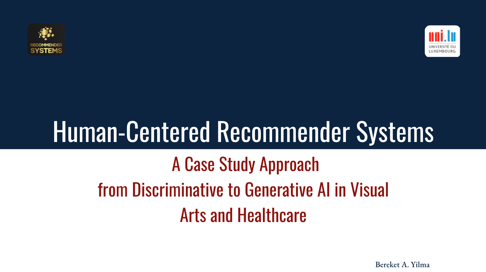

# HC-RecSys25
Human-Centered Recommender Systems:  A Case Study Approach 
from Discriminative to Generative AI in Visual
Arts and Healthcare

 

Doctoral education programme in Computer Science and Computer Engineering at University of Luxembourg
